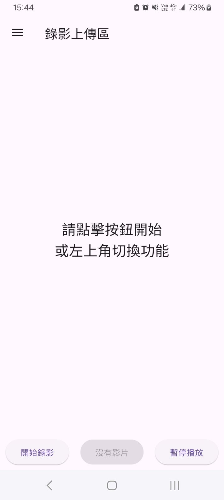

## 本專案為個人專題練習使用

# Banana-App：香蕉過熟度辨識App

使用 Flutter 開發的行動應用程式，結合 Android Camera2 與 YOLOv7 模型，可即時辨識香蕉熟度，並預估可食用天數，協助倉儲管理與品質控管。

## 功能介紹

- 即時串流影像（Camera2 + Flutter）
- 香蕉熟度分類（7 階段，YOLOv7 模型）
- 自動標示與存圖，支援上傳辨識紀錄
- 錄影 / 拍照功能整合
- 可瀏覽過去辨識紀錄與圖片

### 介面示意圖

| 首頁 | 錄影辨識中 | 錄影播放 |
|------|-------------|----------|
|  |  |  |

| 選單 | 拍照前 | 拍照結果 |
|------|-------------------------|-------------------------|
|  |  |  |

| 即時辨識 | 辨識紀錄 |  |
|-------------|--------------|---|
|  |  | |

## 原始碼說明

- `lib/camera_controller.dart`：Flutter 與原生 Android 相機溝通的橋接控制器。透過 `MethodChannel` 控制啟動/停止相機，並使用 `EventChannel` 取得 JPEG 影像串流，用於即時辨識。
- `lib/main.dart`：主頁與各畫面入口，包含 UI 結構、按鈕邏輯等。
- `android/app/src/main/kotlin/com/example/realtime/Camera2Manager.kt`：
  使用 Camera2 API 控制實體相機，將 YUV 畫面轉為 JPEG 並旋轉壓縮後，透過 WebSocket 傳送至後端伺服器，同時透過回呼將影像資料傳回 Flutter 顯示。
- `android/app/src/main/kotlin/com/example/realtime/MainActivity.kt`：
  Flutter 與 Android 原生間的橋接類別。透過 `MethodChannel` 接收 Flutter 的啟動/停止指令，並使用 `EventChannel` 將 `Camera2Manager` 回傳的 JPEG 影像資料送至 Flutter 端進行畫面顯示。

## 注意事項

- 請至 `lib/main.dart` 中搜尋註解關鍵字 `須改`，將程式中使用的後端網址（URL）替換為你自己的伺服器位址，才能正確連接後端辨識服務。
- 請至 `android/app/src/main/kotlin/com/example/realtime/Camera2Manager.kt` 中修改變數 `webSocketUrl`，替換為你自己的 WebSocket 伺服器位址（wss://...）。
- 本 App 須配合後端伺服器一同使用，請參考 [Node.js YOLOv7 後端專案](https://github.com/lentend/nodejs-server.git)